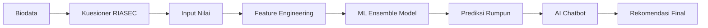

# 🎓 RekoJurusan AI v2

> **Sistem Rekomendasi Jurusan Kuliah berbasis AI** — Menganalisis kepribadian RIASEC, nilai akademik, dan Machine Learning untuk memberikan rekomendasi jurusan kuliah yang tepat untuk siswa SMA di Indonesia.

[](https://streamlit.io/)
[](https://www.python.org/)
[](https://ai.google.dev/)

---

## 📋 Daftar Isi

- [Fitur Utama](#-fitur-utama)
- [Demo](#-demo)
- [Cara Kerja](#-cara-kerja)
- [Instalasi](#-instalasi)
- [Konfigurasi](#-konfigurasi)
- [Cara Menjalankan](#-cara-menjalankan)
- [Teknologi](#-teknologi)
- [Struktur Data](#-struktur-data)
- [Troubleshooting](#-troubleshooting)
- [Kontribusi](#-kontribusi)
- [Lisensi](#-lisensi)

---

## ✨ Fitur Utama

### 1. **Analisis Kepribadian RIASEC**
- **42 pertanyaan** berbasis Holland Code (RIASEC: Realistic, Investigative, Artistic, Social, Enterprising, Conventional)
- Pertanyaan format Ya/Tidak untuk kemudahan menjawab
- Visualisasi skor radar chart interaktif dengan Plotly
- Penentuan kode Holland 3 huruf (misal: ISE, RIA, dll.)

### 2. **Input Nilai Akademik Dinamis**
- Formulir nilai mata pelajaran yang menyesuaikan dengan peminatan siswa:
  - **IPA**: Matematika, Fisika, Kimia, Biologi
  - **IPS**: Matematika, Ekonomi, Geografi, Sosiologi
  - **Bahasa**: Bahasa Indonesia, Bahasa Inggris, Sastra
- Validasi otomatis rentang nilai 0-100

### 3. **Prediksi Rumpun Fakultas dengan Machine Learning**
- **Model Ensemble** (Random Forest, Gradient Boosting, XGBoost, LightGBM)
- Prediksi untuk 10 rumpun fakultas:
  - Teknik & Informatika
  - Kedokteran & Kesehatan
  - Ekonomi & Bisnis
  - Sains & Matematika
  - Sosial & Humaniora
  - Hukum & Politik
  - Pendidikan
  - Seni & Desain
  - Pertanian & Lingkungan
  - Komunikasi & Media
- Probabilitas prediksi dalam persentase

### 4. **Rekomendasi Jurusan Spesifik**
- **250+ program studi** terintegrasi dalam 10 rumpun
- Deskripsi lengkap setiap rumpun
- Saran universitas ternama (PTN & PTS)
- Prospek karir untuk setiap rumpun

### 5. **AI Chatbot dengan Google Gemini**
- Konseling interaktif berbasis **Gemini 2.5 Flash**
- Streaming response untuk pengalaman real-time
- Pertanyaan populer (suggested questions) untuk quick start
- Analisis lintas jurusan (misal: dari IPA ke Komunikasi)
- Rekomendasi kampus, prospek karir, dan gaji
- Riwayat chat yang dapat dihapus

### 6. **UI/UX Modern**
- Design **dark mode** dengan gradient indigo-purple
- Font **Plus Jakarta Sans** dari Google Fonts
- Responsive layout dengan Streamlit columns
- Animasi dan transisi smooth
- Icon dan badge informatif
- Visualisasi data interaktif (Plotly charts)

---

## 🎬 Demo

### Tampilan Utama
```
🎓 REKO JURUSAN AI
AI-Powered College Major Recommendation System
```

### Alur Aplikasi
1. **Step 1**: Input biodata (Nama, Peminatan SMA)
2. **Step 2**: Isi kuesioner RIASEC (42 pertanyaan)
3. **Step 3**: Input nilai mata pelajaran
4. **Step 4**: Lihat hasil analisis dan chatbot AI

---

## 🔧 Cara Kerja

### Pipeline Analisis



### Model Machine Learning

Aplikasi ini menggunakan **Voting Classifier** yang menggabungkan 4 model:

1. **Random Forest** (100 trees)
2. **Gradient Boosting** (100 estimators)
3. **XGBoost** (100 estimators)
4. **LightGBM** (100 estimators)

**Fitur Input:**
- 6 skor RIASEC (0-10)
- 4 nilai mata pelajaran (0-100)
- 1 kode peminatan (encoded)

**Output:**
- Top 3 rumpun fakultas dengan probabilitas

---

## 📦 Instalasi

### Prasyarat
- Python 3.8 atau lebih tinggi
- pip (Python package manager)
- Google Gemini API Key (gratis di [Google AI Studio](https://ai.google.dev/))

### Langkah Instalasi

1. **Clone Repository**
```bash
git clone https://github.com/username/rekojurusan-ai.git
cd rekojurusan-ai
```

2. **Buat Virtual Environment (Opsional, tapi disarankan)**
```bash
python -m venv venv
source venv/bin/activate  # Linux/Mac
venv\Scripts\activate     # Windows
```

3. **Install Dependencies**
```bash
pip install -r requirements.txt
```

### File `requirements.txt`

```txt
streamlit==1.32.0
pandas==2.2.0
numpy==1.26.0
scikit-learn==1.4.0
xgboost==2.0.3
lightgbm==4.3.0
plotly==5.18.0
google-genai==0.5.0
gdown==5.1.0
```

---

## ⚙️ Konfigurasi

### 1. Gemini API Key

Dapatkan API key gratis di [Google AI Studio](https://ai.google.dev/):

1. Kunjungi https://ai.google.dev/
2. Klik "Get API Key"
3. Salin API key Anda

**Cara menggunakan:**
- Saat pertama kali menjalankan aplikasi, masukkan API key di sidebar
- API key akan disimpan di `st.session_state` (tidak persisten)

> ⚠️ **Catatan**: Google Gemini API free tier memiliki limit kuota harian. Jika terpakai habis, Anda akan melihat error `RESOURCE_EXHAUSTED`. Tunggu 24 jam atau upgrade ke paid tier.

### 2. Model ML (Opsional - Auto Download)

Aplikasi akan otomatis mendownload model dari Google Drive saat pertama kali dijalankan jika file tidak ditemukan.

**Manual Download:**
```bash
# Jika auto-download gagal, download manual:
# 1. Download dari: https://drive.google.com/file/d/1dM11rQS6D4g92eA59yJ9hFPP3qZlhEaH/view?usp=sharing
# 2. Letakkan di folder yang sama dengan mainappgenai.py
# 3. Rename jadi: ENSEMBLE_VOTING_CLASSIFIER.pkl
```

**Model ID yang digunakan:**
- File: `ENSEMBLE_VOTING_CLASSIFIER.pkl`
- Google Drive ID: `1dM11rQS6D4g92eA59yJ9hFPP3qZlhEaH`

---

## 🚀 Cara Menjalankan

### Menjalankan Aplikasi

```bash
streamlit run mainappgenai.py
```

Aplikasi akan otomatis membuka browser di `http://localhost:8501`

### Menjalankan di Server Cloud

**Deploy ke Streamlit Cloud (Gratis):**

1. Push code ke GitHub
2. Buka [share.streamlit.io](https://share.streamlit.io/)
3. Login dengan GitHub
4. Deploy repository Anda
5. Tambahkan `GEMINI_API_KEY` di Secrets (Settings → Secrets)

Format `secrets.toml`:
```toml
GEMINI_API_KEY = "your-api-key-here"
```

**Deploy ke Platform Lain:**
- Heroku: Tambahkan `Procfile` dengan `web: streamlit run mainappgenai.py`
- Railway: Auto-detect Streamlit app
- Google Cloud Run: Gunakan Dockerfile

---

## 🛠️ Teknologi

### Backend
| Teknologi | Fungsi |
|-----------|--------|
| **Python 3.8+** | Bahasa pemrograman utama |
| **Streamlit** | Web framework untuk UI interaktif |
| **Pandas & NumPy** | Manipulasi data dan komputasi numerik |
| **Scikit-learn** | Preprocessing & model ensemble |
| **XGBoost** | Gradient boosting framework |
| **LightGBM** | Efficient gradient boosting |

### AI & Machine Learning
| Komponen | Detail |
|----------|--------|
| **Google Gemini 2.5 Flash** | Generative AI untuk chatbot |
| **Voting Classifier** | Ensemble 4 model ML |
| **RIASEC Holland Code** | Framework psikologi karir |

### Frontend
| Library | Fungsi |
|---------|--------|
| **Plotly** | Visualisasi chart interaktif |
| **Google Fonts** | Typography (Plus Jakarta Sans) |
| **Custom CSS** | Styling & theming |

### Data Storage
| Tipe | Format |
|------|--------|
| Model ML | Pickle (.pkl) |
| Session State | In-memory (Streamlit) |
| Jurusan Database | Hardcoded dictionary (Python) |

---

## 📊 Struktur Data

### RIASEC Questions Format
```python
RIASEC_QUESTIONS = [
    ("Pertanyaan...", "R"),  # R/I/A/S/E/C
    # 7 pertanyaan per dimensi = 42 total
]
```

### Rumpun Info Structure
```python
RUMPUN_INFO = {
    "Teknik & Informatika": {
        "jurusan": ["Teknik Informatika", "Teknik Elektro", ...],
        "kampus": ["UI", "ITB", "UGM", ...],
        "deskripsi": "...",
        "prospek": "..."
    },
    # ... 9 rumpun lainnya
}
```

### Session State Variables
```python
st.session_state.step           # 1-4
st.session_state.nama           # String
st.session_state.peminatan      # IPA/IPS/Bahasa
st.session_state.riasec_answers # List[bool] (42 items)
st.session_state.riasec_scores  # Dict[str, float]
st.session_state.nilai          # Dict[str, float]
st.session_state.chat_messages  # List[Dict]
```

---

## 🐛 Troubleshooting

### 1. **Error: Module 'google.genai' not found**
```bash
pip install google-genai --upgrade
```

### 2. **Error: Model file tidak ditemukan**
- Cek koneksi internet (auto-download butuh akses Google Drive)
- Download manual dari link di atas
- Pastikan nama file: `ENSEMBLE_VOTING_CLASSIFIER.pkl`

### 3. **Error: Gemini API RESOURCE_EXHAUSTED**
- Free tier Gemini memiliki limit harian
- Tunggu 24 jam atau ganti API key baru
- Upgrade ke paid tier di [Google Cloud Console](https://console.cloud.google.com/)

### 4. **UI tidak muncul / CSS rusak**
- Clear browser cache
- Restart Streamlit server
- Cek console browser untuk error JavaScript

### 5. **Plotly chart tidak render**
```bash
pip install plotly --upgrade
```

### 6. **Streamlit terlalu lambat**
- Reduce `max_tokens` di Gemini API call
- Cache model ML dengan `@st.cache_resource`
- Minimize widget rerun dengan `key` parameter

---

## 🤝 Kontribusi

Kontribusi sangat diterima! Berikut cara berkontribusi:

### Langkah Berkontribusi
1. **Fork repository ini**
2. **Buat branch fitur** (`git checkout -b feature/AmazingFeature`)
3. **Commit perubahan** (`git commit -m 'Add some AmazingFeature'`)
4. **Push ke branch** (`git push origin feature/AmazingFeature`)
5. **Buat Pull Request**

### Area yang Bisa Dikembangkan
- [ ] Tambah support untuk kurikulum merdeka
- [ ] Integrasi database PostgreSQL untuk menyimpan riwayat user
- [ ] Export hasil PDF report
- [ ] Multi-language support (English, dll.)
- [ ] Mobile app dengan React Native
- [ ] A/B testing untuk meningkatkan akurasi model
- [ ] Tambah fitur "Compare Programs" side-by-side
- [ ] Integrasi API SNBP/SNBT untuk info passing grade

### Code Style
- Gunakan **PEP 8** untuk Python code
- Tambahkan docstring untuk fungsi kompleks
- Test sebelum commit (minimal manual testing)

---

## 📄 Lisensi

Proyek ini dilisensikan di bawah **MIT License**.

```
MIT License

Copyright (c) 2025 RekoJurusan AI Contributors

Permission is hereby granted, free of charge, to any person obtaining a copy
of this software and associated documentation files (the "Software"), to deal
in the Software without restriction, including without limitation the rights
to use, copy, modify, merge, publish, distribute, sublicense, and/or sell
copies of the Software, and to permit persons to whom the Software is
furnished to do so, subject to the following conditions:

The above copyright notice and this permission notice shall be included in all
copies or substantial portions of the Software.

THE SOFTWARE IS PROVIDED "AS IS", WITHOUT WARRANTY OF ANY KIND, EXPRESS OR
IMPLIED, INCLUDING BUT NOT LIMITED TO THE WARRANTIES OF MERCHANTABILITY,
FITNESS FOR A PARTICULAR PURPOSE AND NONINFRINGEMENT. IN NO EVENT SHALL THE
AUTHORS OR COPYRIGHT HOLDERS BE LIABLE FOR ANY CLAIM, DAMAGES OR OTHER
LIABILITY, WHETHER IN AN ACTION OF CONTRACT, TORT OR OTHERWISE, ARISING FROM,
OUT OF OR IN CONNECTION WITH THE SOFTWARE OR THE USE OR OTHER DEALINGS IN THE
SOFTWARE.
```

---

## 👨‍💻 Pengembang

Dikembangkan dengan ❤️ oleh **Tim RekoJurusan AI**

### Kontak & Support
- 📧 Email: support@rekojurusan.ai (contoh)
- 🐛 Issues: [GitHub Issues](https://github.com/username/rekojurusan-ai/issues)
- 💬 Discussion: [GitHub Discussions](https://github.com/username/rekojurusan-ai/discussions)

---

## 🙏 Acknowledgments

- **Google Gemini** untuk free tier API
- **Streamlit** untuk framework yang amazing
- **Holland Code** untuk framework RIASEC
- **Scikit-learn** untuk ML tools
- **Plotly** untuk visualisasi interaktif
- **Community contributors** yang telah membantu

---

## 📈 Roadmap

### Version 2.1 (Q2 2025)
- [ ] Export PDF report
- [ ] PostgreSQL database integration
- [ ] User authentication system

### Version 2.2 (Q3 2025)
- [ ] Mobile app (React Native)
- [ ] English language support
- [ ] Integration dengan API kampus

### Version 3.0 (Q4 2025)
- [ ] AI interview simulation
- [ ] Video guidance untuk setiap jurusan
- [ ] Partnership dengan universitas

---

## ⭐ Star History

Jika proyek ini membantu Anda, jangan lupa berikan **Star** ⭐ di GitHub!

---

**Made with ❤️ in Indonesia**
